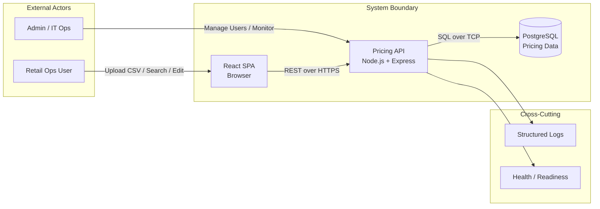

# Context Diagram

Shows the system boundary, external actors, and primary data flows.

## Actors

| Actor | Description |
|---|---|
| Retail Ops User | Uploads pricing feeds, searches records, edits prices via the SPA. |
| Admin / IT Ops | Manages user accounts, monitors health, reviews audit logs. |

## Data Flows

| Flow | Protocol | Purpose |
|---|---|---|
| SPA → API | REST/JSON over HTTP | Authentication, upload, search, edit |
| API → DB | PostgreSQL wire protocol | Persistence, querying, audit logging |
| API → Logs | stdout/stderr | Structured request and error logging |
