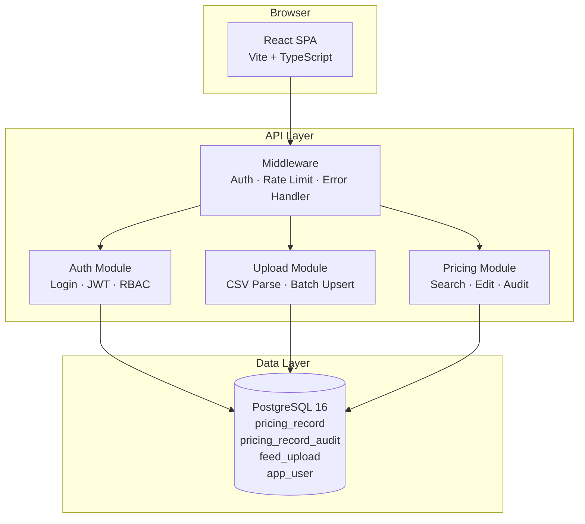

# Solution Architecture

## High-Level View



## Backend Module Structure

```
backend/src/
├── config/          # Environment variables, DB pool
├── middleware/       # Auth guard, error handler, rate limiter
├── modules/
│   ├── auth/        # Login validator, service, routes
│   ├── upload/      # CSV validator, batch service, routes
│   └── pricing/     # Search/edit validator, repository, service, routes
├── types/           # Shared TypeScript interfaces
├── app.ts           # Express bootstrap + middleware wiring
└── index.ts         # Server entry point
```

## Frontend Component Structure

```
frontend/src/
├── api/             # Axios client, auth API, pricing API
├── hooks/           # useAuth, usePricingSearch
├── components/      # LoginView, UploadPanel, SearchPanel,
│                    # ResultsTable, Pagination, EditDrawer, StatusMessage
├── types/           # Shared TypeScript interfaces
├── App.tsx          # Root shell composing components
├── main.tsx         # React entry point
└── styles.css       # Global styles
```

## Key Architectural Patterns

| Pattern | Where | Why |
|---|---|---|
| Layered architecture | Backend modules | Separation of concerns; testable services |
| Repository pattern | `pricing.repository.ts` | Isolates SQL from business logic |
| Middleware chain | `auth.ts`, `rate-limit.ts`, `errors.ts` | Cross-cutting concerns decoupled from routes |
| Custom hooks | `useAuth`, `usePricingSearch` | Encapsulate state + API logic away from UI |
| Component composition | `App.tsx` | Thin root; each feature is a focused component |
